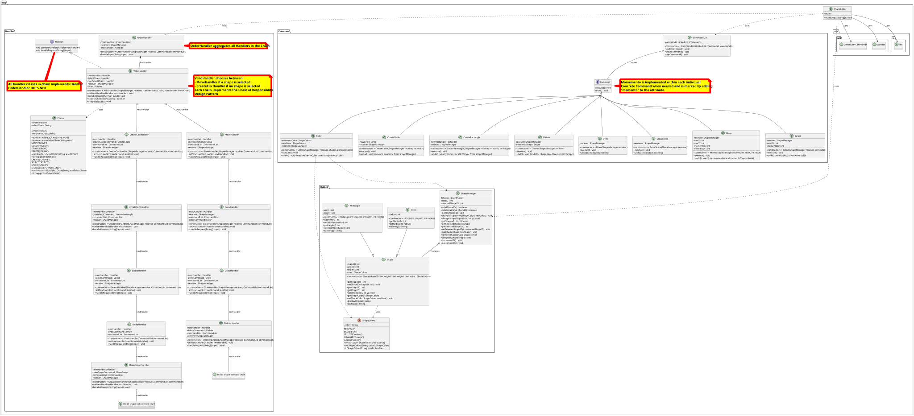

# Draw Program without Drawing
## Command, Memento(kind of) and Chain of Responsiblity behavior patterns

## Summary

Main function of this project is to create shapes(Rectangles and Circles) whose data can be manipulated by various commands given by a text file and then produce another text file as a result  of the commands, then be used by a theoretical graphic program to display the shapes.

# Basics
## Shapes
- Parent Class Shape is inherited by Circle and Rectangle Child classes
- Enum ShapeColors is used to ensure a valid color is used.
- The ShapeManager class acts as a receiver for the commands and includes all of the functions that commands will call on to implement their commands.
## Commands/Memento
- The Command Pattern is implemented for manipulation and creation of Shapes
- Whithin the Command pattern, Mementos are used to implement an Undo command. For certain commands, a memento is stored within the command itself to be implemented when Undo is called.
- The command interface requires execute() and undo()
- Commands are stroed in a linkedList which I treat as a stack data structure. When Undo is called, I pop the top of the stack and call the undo of that command
## Chain of Responsiblity (COR)
- Handler interface requires a nextHandler(Handler nextHandler) and handleRequest(String[] input) funcions.
- The COR pattern is implemented to handle input from the text file to determine the command. Two possible chain paths are implemented, one if a SELECT command IS required and another if a SELECT command is NOT required. 

1) **SELECT Required Chain** = ValidHandler -> MoveHandler -> ColorHandler -> DrawHandler -> DeleteHandler -> NULL

2) **SELECT NOT Required Chain** = ValidHandler -> CreateCircleHandler -> CreateRectangleHandler -> SelectHandler -> UndoHandler -> DrawHandler -> NULL

- I also have a **OrderHandler** class file to initiate all of the handlers

## Build and Run
This program uses **Maven** for dependency management and compilation.

### UML Diagram

